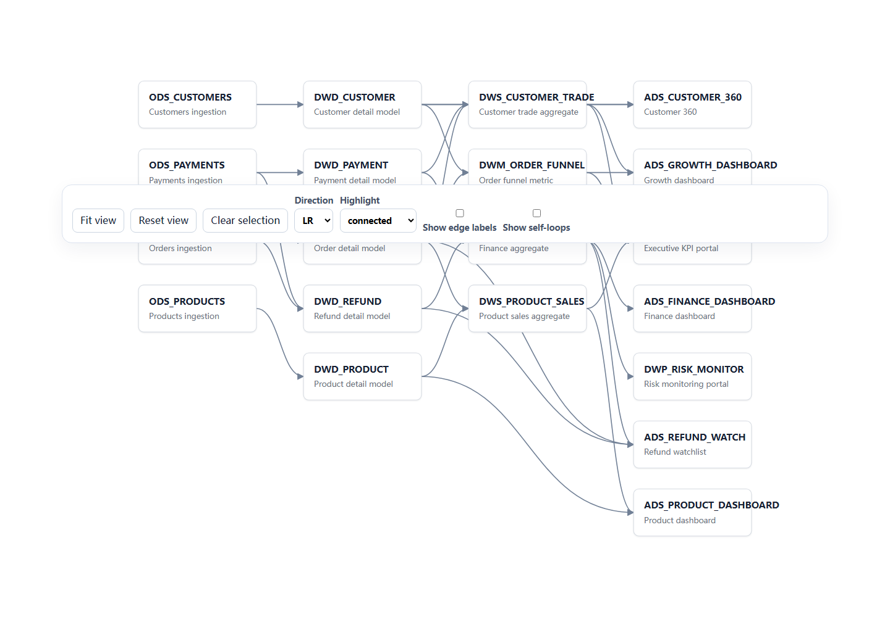
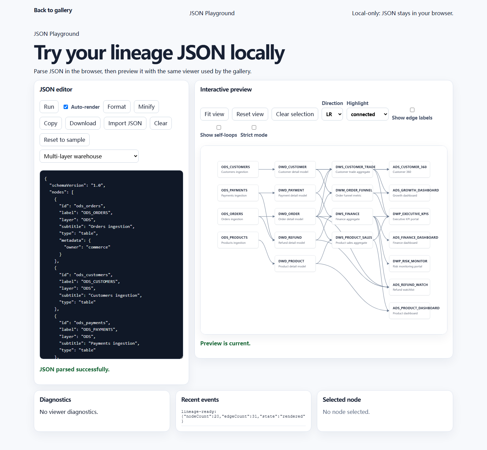

# lineage-viewer

[简体中文](./README.md) | English

> A lightweight, framework-agnostic, embeddable lineage graph viewer built with native Web Components and SVG.

[](https://github.com/0verme/lineage-viewer/actions/workflows/ci.yml) `Alpha` · `TypeScript` · `Web Component` · `Zero runtime dependencies` · `Apache-2.0`

[Live demo](https://lineage.overme.cn) · [JSON Playground](https://lineage.overme.cn/playground.html) · [Quick start](#quick-start) · [中文文档](./README.md) · [Changelog](CHANGELOG.md)





## Project status

This project is Alpha / under active development. The current version is `0.1.0-alpha.1`; the API may still change. The Alpha release is published to npm under the `alpha` dist-tag.

## Live demo

The production demo is [lineage.overme.cn](https://lineage.overme.cn). The site supports Simplified Chinese and English, defaults to Chinese, and accepts `?lang=zh-CN` or `?lang=en`. The language switcher stores the preference and preserves the language parameter on the current page. Stable demo URLs use `/demo.html?id=<demo-id>`; the Playground is `/playground.html`.

## Core features

- TypeScript, native browser APIs, ESM, Web Components, Shadow DOM, and SVG.
- JSON validation, normalization, stable diagnostics, and strict/lenient modes.
- Duplicate node/edge, self-loop, and missing source/target handling; upstream/downstream/connected highlights.
- Deterministic layered layout in `LR`, `RL`, `TB`, and `BT`; zoom, pan, fit, reset, focus, and selection.
- A static Demo Gallery, JSON Playground, minimal vanilla/React/Vue examples, and host-consumable events.

### Implemented foundations

The repository includes Vite, Vitest, Playwright, ESLint, Prettier, packaging, and CI baselines. Its deterministic layout performs SCC condensation, longest-path ranking, stable layer ordering, basic crossing reduction, and disconnected-block packing. The SVG viewer has nodes, edges, arrowheads, empty/invalid states, and `ResizeObserver`-aware sizing. `examples/vanilla/`, `examples/react/`, and `examples/vue/` provide minimal integration examples; the demo site provides multiple scenarios, read-only JSON, diagnostics, and event inspection.

Its technical principles are TypeScript strict mode, native browser APIs and ESM, zero runtime dependencies where practical, separation of schema/graph/layout/rendering/interaction responsibilities, synthetic data in public examples, and explicit custom-element registration instead of import-time global side effects.

## Use cases

Use lineage-viewer to visualize standardized nodes and edges for warehouses, ETL pipelines, jobs, datasets, or fields. It is a viewer, not a lineage-extraction or data-governance platform: it does not parse SQL, discover lineage, scan databases or schedulers, store metadata, manage users, edit graphs, or replace Apache Atlas or DataHub.

## Quick start

Install the Alpha release from npm:

```sh
npm install lineage-viewer@alpha
```

```html
<lineage-viewer id="viewer"></lineage-viewer>
```

```ts
import "lineage-viewer/define";

const viewer = document.querySelector("#viewer") as import("lineage-viewer").LineageViewerElement;
viewer.data = {
  nodes: [
    { id: "ods_orders", label: "ODS Orders", subtitle: "Raw order data" },
    { id: "dwd_orders", label: "DWD Order Details", subtitle: "Normalized order details" },
  ],
  edges: [{ id: "edge_1", source: "ods_orders", target: "dwd_orders", label: "Transform" }],
};
```

```css
lineage-viewer {
  display: block;
  width: 100%;
  height: 600px;
}
```

## Installation

lineage-viewer runs in modern browsers with Custom Elements, Shadow DOM, SVG, `ResizeObserver`, and ES modules; it is not a Node.js runtime library. For now, run `npm pack` in this repository and install the resulting tarball in a consuming project. Use the npm command above only after publication.

## Basic usage

`lineage-viewer/define` registers `<lineage-viewer>` automatically. The root entry has no side effect and supports explicit registration:

```ts
import { defineLineageViewer } from "lineage-viewer";
defineLineageViewer();
```

Set graph input using `data` or `setData()`. Mutations to an already assigned object are not observed, so assign it again or call `setData()` after changing it.

## JSON data format

`schemaVersion` is optional or `"1.0"`; `nodes` and `edges` must be arrays. Node `id` values are unique, and each edge `source` and `target` must reference an existing node. Labels are always plain text.

```json
{
  "schemaVersion": "1.0",
  "nodes": [{ "id": "orders", "label": "Orders" }],
  "edges": []
}
```

See [data schema and diagnostics](docs/data-schema.md) for all fields, diagnostic codes, and validation rules.

## Web Component properties

All inputs are JavaScript properties; no HTML attributes are observed or synchronized. Reading `options` returns a resolved read-only snapshot; setting it accepts a partial options patch. Defaults are `direction: "LR"`, `fitOnLoad: true`, `readonly: true`, `showSelfLoops: false`, `showEdgeLabels: false`, `validationMode: "lenient"`, `nodeWidth: 180`, `nodeHeight: 72`, `layerGap: 72`, `nodeGap: 32`, and `highlightMode: "connected"`. `selectedNodeId` is read-only.

## JavaScript API

The public API is `setData(data)`, `setOptions(options)`, `getDiagnostics()`, `fitView()`, `resetView()`, `focusNode(nodeId)`, `selectNode(nodeId)`, `clearSelection()`, and `destroy()`. `focusNode` and `selectNode` ignore unknown nodes. `destroy()` is idempotent and permanently disables the instance. See the [public API](docs/public-api.md).

## Events

The component dispatches bubbling, composed `CustomEvent`s: `lineage-ready`, `lineage-error`, `lineage-warning`, `lineage-node-click`, and `lineage-selection-change`. See [public API](docs/public-api.md) for detail shapes.

## Highlighting and interaction

Mouse-wheel zoom is anchored at the pointer; drag blank canvas to pan. Clicking a node selects it and emits events; clicking blank canvas clears selection. `highlightMode` accepts `connected`, `upstream`, `downstream`, or `none`. Use `fitView()`, `resetView()`, and `focusNode()` for viewport control.

## Strict and lenient modes

The default `lenient` mode retains recoverable data where possible and reports diagnostics. `strict` mode produces no graph if any error occurs. Invalid root shapes and unsupported Schema versions are unrecoverable in both modes. The first valid duplicate node wins; duplicate edges are deduplicated. Self-loops are hidden unless `showSelfLoops` is enabled.

## iframe embedding

Embed the hosted demo directly when you do not need cross-window API control:

```html
<iframe
  title="lineage-viewer live demo"
  src="https://lineage.overme.cn/?lang=en"
  width="100%"
  height="720"
></iframe>
```

To render your own data, install the component in the host page and assign `data` instead of relying on the demo iframe.

## Local development

Node.js `>=22.13.0` is required.

```sh
npm ci
npm run check
```

Playwright may require `npx playwright install chromium` in a fresh environment.

## Build commands

```sh
npm run dev
npm run typecheck
npm run lint
npm run format:check
npm test
npm run test:e2e
npm run build
npm run build:site
npm run preview:site
npm run pack:check
npm run test:package
npm run screenshot:gallery
npm run screenshot:playground
```

`build` writes ESM and declarations to `dist`; `build:site` writes the static site to `site-dist`. Deploy with `npx wrangler deploy` after configuring Cloudflare credentials.

`wrangler.jsonc` configures `site-dist/` as Cloudflare Workers Static Assets. The `cloudflare.yml` workflow builds and deploys the site on pushes to `main` or manual dispatch; configure `CLOUDFLARE_API_TOKEN` and `CLOUDFLARE_ACCOUNT_ID` in the repository first. Run the screenshot commands only when intentionally updating the documentation screenshots above.

## Browser compatibility

Modern browsers with Custom Elements, Shadow DOM, SVG, `ResizeObserver`, and ES modules are supported. The project does not claim compatibility with legacy browsers or Node.js runtimes.

## Roadmap

Package consumption and public API freeze foundations are complete. Direct integration documentation and framework examples are planned next. See the [roadmap](docs/roadmap.md).

## Known limitations

Layout uses fixed node dimensions and does not measure text, avoid obstacles, add dummy nodes for long edges, provide complete orthogonal routing, or guarantee minimum crossings. Cyclic SCCs use a deterministic same-layer mini-stack. `readonly` is currently stored but has no distinct interaction behavior. Internal Shadow DOM classes, SVG structure, and generated IDs are not compatibility guarantees.

## Contributing

Issues and pull requests are welcome. Run relevant checks before submitting and avoid generated or unrelated changes. See [release readiness](docs/release-readiness.md) for the release checklist. All public examples and tests use synthetic data.

## License

Licensed under the Apache License, Version 2.0. See [LICENSE](LICENSE) and [NOTICE](NOTICE).
