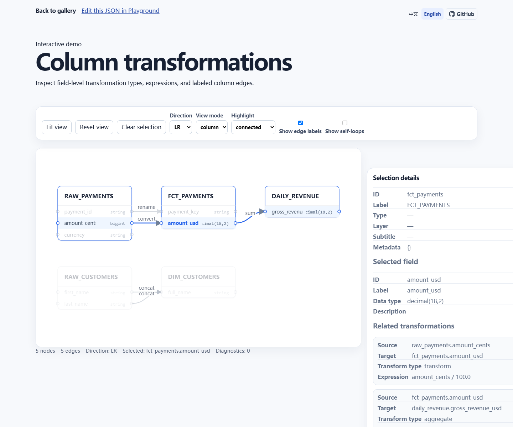

# lineage-viewer

简体中文 | [English](./README.en.md)

> A lightweight, framework-free Web Component for interactive table-level and column-level data lineage visualization.

lineage-viewer 是一个轻量、无框架依赖、可嵌入的数据血缘查看器。它使用原生 Web Component、Shadow DOM 和 SVG，仅需传入 JSON，即可在任意网页或前端框架中展示交互式表级与字段级血缘。

[](https://github.com/0verme/lineage-viewer/actions/workflows/ci.yml) `Alpha` · `TypeScript` · `Web Component` · `Zero runtime dependencies` · `Apache-2.0`

[在线演示](https://lineage.overme.cn) · [字段转换示例](https://lineage.overme.cn/demo.html?id=column-transform) · [JSON Playground](https://lineage.overme.cn/playground.html) · [快速开始](#快速开始) · [英文文档](./README.en.md)



## Features

- Table lineage
- Column lineage
- Mixed lineage
- Field dependency tracing
- SVG rendering
- Shadow DOM isolation
- Zero framework dependency
- Embeddable anywhere

字段边支持 `passthrough`、`rename`、`transform` 和 `aggregate` 元数据，以及 `SUM(amount)`、`concat(first_name, last_name)` 等表达式。点击字段可按 `upstream`、`downstream` 或 `both` 高亮完整路径。

## Demo

[lineage.overme.cn](https://lineage.overme.cn) 提供可切换的表级、字段级和 Transformation 展示，以及只在浏览器本地处理数据的 [JSON Playground](https://lineage.overme.cn/playground.html)。

- [Table lineage](https://lineage.overme.cn/demo.html?id=simple-pipeline)
- [Column lineage](https://lineage.overme.cn/demo.html?id=column-basic)
- [Transformation](https://lineage.overme.cn/demo.html?id=column-transform)

每个 Demo 都可查看输入 JSON、点击字段、高亮路径，并检查组件派发的事件。

## Why lineage-viewer

完整的数据治理平台通常同时包含采集、存储、权限和协作能力，但很多产品只需要一个可以嵌入现有页面的血缘 Viewer。

lineage-viewer 专注于：

- **Lightweight**：零运行时框架依赖。
- **Embeddable**：标准 Web Component，可用于原生 JavaScript、React、Vue 或 iframe 场景。
- **Customizable**：Schema 驱动，接收已有的表、任务、数据集或字段血缘 JSON。

它不负责 SQL 解析、自动发现血缘或元数据存储；这些能力通过独立 Adapter 扩展。[SQLGlot Adapter](docs/sqlglot-adapter.md) 已支持将 `SELECT`、`JOIN`、别名和聚合转换为 Viewer JSON；[OpenLineage Adapter](docs/openlineage-adapter.md) 可将 RunEvent 中的 Job、Dataset 与字段血缘转换为同一格式。两个 Adapter 均不会把解析依赖引入 Web Component 核心。

## 快速开始

npm 发布后可直接安装：

```sh
npm install lineage-viewer
```

```html
<lineage-viewer></lineage-viewer>
```

```ts
import "lineage-viewer/define";
```

## 项目状态

项目目前处于 Alpha / 积极开发中。当前待发布版本为 `0.1.0-alpha.2`，API 在后续版本中仍可能调整。npm Alpha 发布待完成 trusted publisher 配置后触发。

## 在线演示

正式演示站点为 [lineage.overme.cn](https://lineage.overme.cn)。站点默认使用简体中文，支持 `?lang=zh-CN` 与 `?lang=en`；切换按钮会保存语言偏好，并为当前页面保留语言参数。稳定演示地址为 `/demo.html?id=<demo-id>`，JSON Playground 为 `/playground.html`。

## 核心特性

- 以 TypeScript 编写，使用原生浏览器 API、ESM、Web Component、Shadow DOM 和 SVG。
- 校验并规范化 JSON 数据；提供稳定诊断信息，以及 strict（严格模式）与 lenient（宽松模式）。
- 处理重复节点、重复边、缺失 source/target、自环和环；支持 upstream、downstream、connected 高亮。
- 使用确定性的分层布局，支持 `LR`、`RL`、`TB`、`BT` 方向、缩放、平移、fit、reset、聚焦与选择。
- 提供 Demo Gallery、JSON Playground、原生 JavaScript、React、Vue 示例和可供宿主监听的事件。

### 已实现的基础能力

项目已提供 Vite、Vitest、Playwright、ESLint、Prettier、打包与 CI 基线；确定性布局会进行 SCC 收缩、最长路径分层、稳定层内排序、基础交叉减少与断开块打包。SVG 包含节点、边、箭头、空态和无效态，并使用 `ResizeObserver` 适配视图大小。`examples/vanilla/`、`examples/react/` 和 `examples/vue/` 提供最小集成示例；演示站提供多场景、只读 JSON、诊断与事件检查。

技术原则包括：TypeScript strict 模式、原生浏览器 API 和 ESM、尽可能零运行时依赖、Schema/图处理/布局/渲染/交互职责分离、全部公开示例使用合成数据，以及显式注册自定义元素而非导入时修改全局状态。

## 适用场景

适合已经拥有标准化节点与边数据的数仓、ETL、任务、数据集或字段血缘展示。它是查看器，不负责 SQL 解析、自动发现血缘、扫描数据库或调度器、元数据存储、权限管理、协作和通用图编辑，也不替代 Apache Atlas 或 DataHub。

## 完整集成示例

Alpha 发布完成前，可运行 `npm pack` 并安装生成的 tarball。发布后使用：

```sh
npm install lineage-viewer
```

```html
<lineage-viewer id="viewer"></lineage-viewer>
```

```ts
import "lineage-viewer/define";

const viewer = document.querySelector("#viewer");
if (!(viewer instanceof HTMLElement)) throw new Error("找不到 lineage-viewer");

(viewer as import("lineage-viewer").LineageViewerElement).data = {
  nodes: [
    { id: "ods_orders", label: "ODS 订单表", subtitle: "原始订单数据" },
    { id: "dwd_orders", label: "DWD 订单明细", subtitle: "标准订单明细" },
  ],
  edges: [{ id: "edge_1", source: "ods_orders", target: "dwd_orders", label: "清洗转换" }],
};
```

```css
lineage-viewer {
  display: block;
  width: 100%;
  height: 600px;
}
```

## 安装方式

包面向具备 Custom Elements、Shadow DOM、SVG、`ResizeObserver` 与 ES modules 的现代浏览器，不是 Node.js 运行时库。当前请在仓库中运行 `npm pack`，然后在消费项目中安装产生的 tarball。发布后再使用上面的 npm 命令。

## 基础用法

`lineage-viewer/define` 会自动注册 `<lineage-viewer>`；根入口不带副作用，适合需要显式注册的场景：

```ts
import { defineLineageViewer } from "lineage-viewer";
defineLineageViewer();
```

通过 `data` 属性或 `setData()` 设置数据。对象赋值后再直接修改其内部字段不会被观察，修改后须重新赋值或调用 `setData()`。

## JSON 数据格式

`schemaVersion` 可省略或为 `"1.0"`；`nodes` 与 `edges` 必须是数组。节点 `id` 唯一，边的 `source` 与 `target` 必须引用已有节点。`label` 始终按纯文本处理。

```json
{
  "schemaVersion": "1.0",
  "nodes": [{ "id": "orders", "label": "订单" }],
  "edges": []
}
```

完整字段、诊断码和规则见[数据格式文档](docs/data-schema.md)。

## Web Component 属性

全部为 JavaScript properties，不支持也不会同步 HTML attributes。读取 `options` 获得解析后的只读快照，写入时传入部分选项。默认值为：`direction: "LR"`、`fitOnLoad: true`、`readonly: true`、`showSelfLoops: false`、`showEdgeLabels: false`、`validationMode: "lenient"`、`nodeWidth: 180`、`nodeHeight: 72`、`layerGap: 72`、`nodeGap: 32`、`highlightMode: "connected"`。`selectedNodeId` 为只读。

## JavaScript API

`setData(data)`、`setOptions(options)`、`getDiagnostics()`、`fitView()`、`resetView()`、`focusNode(nodeId)`、`focusField(nodeId, fieldId)`、`selectNode(nodeId)`、`selectField(nodeId, fieldId)`、`search()`、`searchFields()`、`clearSelection()` 与 `destroy()` 均为当前公开 API。`searchFields(keyword)` 会按字段名、表名或类型匹配并定位首个结果。未知节点或字段 ID 不执行操作；`destroy()` 幂等且会永久禁用实例。详见[公共 API](docs/public-api.md)。

## 事件

组件派发会冒泡且可穿透 Shadow DOM 的 `CustomEvent`：`lineage-ready`、`lineage-error`、`lineage-warning`、`lineage-node-click`、`lineage-field-click`、`lineage-edge-click`、`lineage-selection-change`。边点击事件包含来源、目标、转换类型和表达式。事件 detail 的完整结构见[公共 API](docs/public-api.md)。

## 高亮与交互

鼠标滚轮以指针位置为锚点 zoom；空白处可拖动平移。点击节点或字段会选择并高亮血缘路径，点击字段边可检查转换详情，点击空白处会清除选择。`highlightMode` 可为 `connected`、`both`、`upstream`、`downstream` 或 `none`；可用 `fitView()`、`resetView()`、`focusNode()` 和 `focusField()` 控制视图。

## 严格模式与宽松模式

默认 lenient（宽松模式）会尽可能保留可恢复的数据，并通过诊断报告问题；strict（严格模式）只要存在错误就不生成图。根对象形状不合法和不支持的 Schema 版本在两种模式下都不可恢复。重复节点优先保留第一个有效项，重复边会去重；默认隐藏自环，打开 `showSelfLoops` 后才显示。

## iframe 嵌入

可直接嵌入正式站点，无需跨窗口 API：

```html
<iframe
  title="lineage-viewer 在线演示"
  src="https://lineage.overme.cn/?lang=zh-CN"
  width="100%"
  height="720"
></iframe>
```

如需展示自己的数据，请在宿主页面安装组件并传入 `data`，而不是依赖此演示 iframe。

## 本地开发

需要 Node.js `>=22.13.0`。安装依赖并运行完整检查：

```sh
npm ci
npm run check
```

Playwright 在新环境中可能需要先执行 `npx playwright install chromium`。

## 构建命令

```sh
npm run dev
npm run typecheck
npm run lint
npm run format:check
npm test
npm run test:e2e
npm run build
npm run build:site
npm run preview:site
npm run pack:check
npm run test:package
npm run screenshot:gallery
npm run screenshot:playground
```

`build` 生成 ESM 与声明文件到 `dist`；`build:site` 生成静态演示站到 `site-dist`。部署使用 `npx wrangler deploy`，并需配置 Cloudflare 凭据。

`wrangler.jsonc` 将 `site-dist/` 配置为 Cloudflare Workers Static Assets。`cloudflare.yml` 在推送到 `main` 或手动触发时构建并部署站点；部署前需在仓库中配置 `CLOUDFLARE_API_TOKEN` 和 `CLOUDFLARE_ACCOUNT_ID`。截图命令仅用于有意更新上方文档截图。

## 浏览器兼容性

支持具备 Custom Elements、Shadow DOM、SVG、`ResizeObserver` 和 ES modules 的现代浏览器。项目未声明旧版浏览器或 Node.js 环境兼容性。

## 项目路线图

当前已完成包消费与公开 API 冻结等基础阶段。后续重点包括直接集成文档和框架示例。详见[路线图](docs/roadmap.md)。

## 已知限制

布局使用固定节点尺寸，不测量文本；不避障、不为长边插入虚拟节点、不提供完整正交路由，也不保证最少交叉。循环 SCC 使用确定性的同层小栈。`readonly` 目前仅保存为选项，尚无独立交互行为；内部 Shadow DOM 类名、SVG 结构和生成 ID 不是兼容性承诺。

## 贡献指南

欢迎通过 issue 或 pull request 参与。提交前请运行相关检查，并避免修改生成产物或无关文件；发布前检查清单位于[发布准备](docs/release-readiness.md)。公开示例和测试仅使用合成数据。

## 开源协议

采用 [Apache License 2.0](LICENSE)；另请阅读 [NOTICE](NOTICE)。
